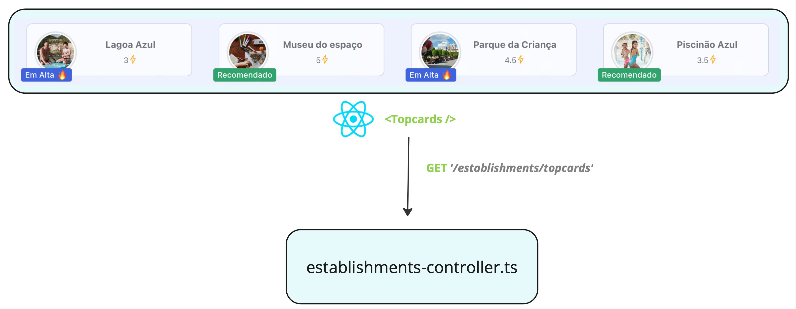

# LevaEu

> You are ate the __frontend__. Source the backend [here](https://github.com/gabrielsacampos/levaeu-node)

## Introduction

LevaEu is a dynamic platform designed to connect people with establishments, offering families an enjoyable and memorable day out. This project is in the early stages of developing a Minimum Viable Product (MVP) as part of a postgraduate Software Engineering sprint at PUC-RJ.


### Architeture

The architecture of LevaEu comprises three main components:

1. **User Interface**: Built with [Vite + React](https://vitejs.dev)
2. **Node.js Server | REST API**: Running [Fastify](https://fastify.dev) and [Knex.js](https://knexjs.org)
3. **Third-Party API**: [ViaCep](https://viacep.com.br), an API that helps our React application find addresses by CEP code

Additionally, each component has a __Dockerfile__ to build the corresponding image.


### Steps to follow the application

To clone this repository to your local machine, follow these steps:

1. Open your terminal.
2. Change the current working directory to the location where you want the cloned directory.
3. Type the following git command and press Enter:
    ```bash
    git clone https://github.com/gabrielsacampos/levaeu-react.git
    ```
4. This will create a local copy of the repository in your desired directory.


#### Running the project on your local machine

1. Navigate to the project directory:
    ```bash
    cd levaeu-react
    ```

2. Ensure that the server is running by following the instructions provided in the backend documentation [here](https://github.com/gabrielsacampos/levaeu-node).

3. Build the image by running the Dockerfile and run it on port 3000:
    ```bash
    docker build -t levaeu-react .
    docker run -p 3000:3000 levaeu-react
    ```

4. Once all commands are successful, you can open the application at [http://localhost:3000](http://localhost:3000).

#### Components x API workflow



_____________________________


_____________________________


_____________________________


_____________________________


_____________________________


